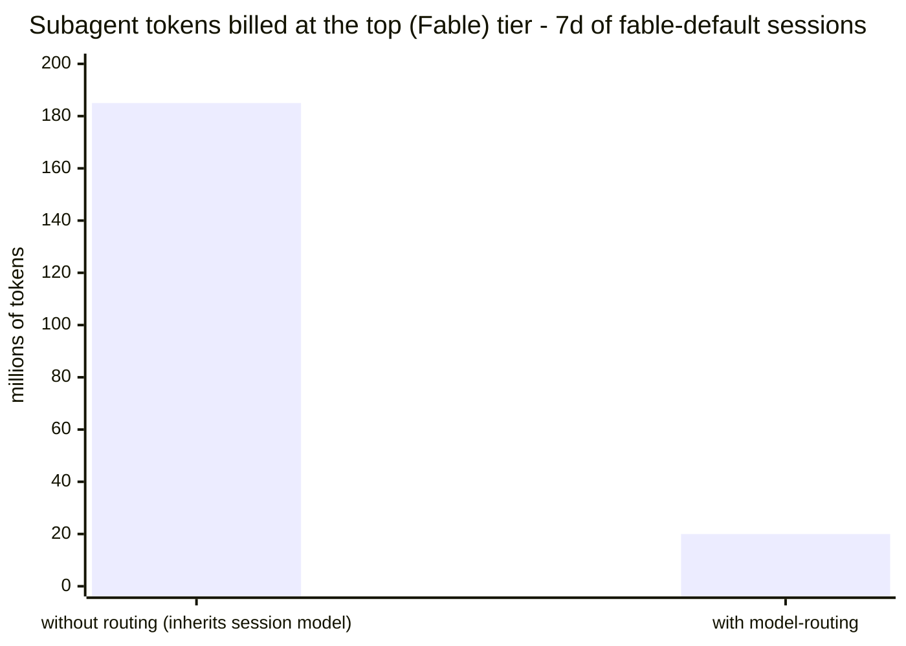
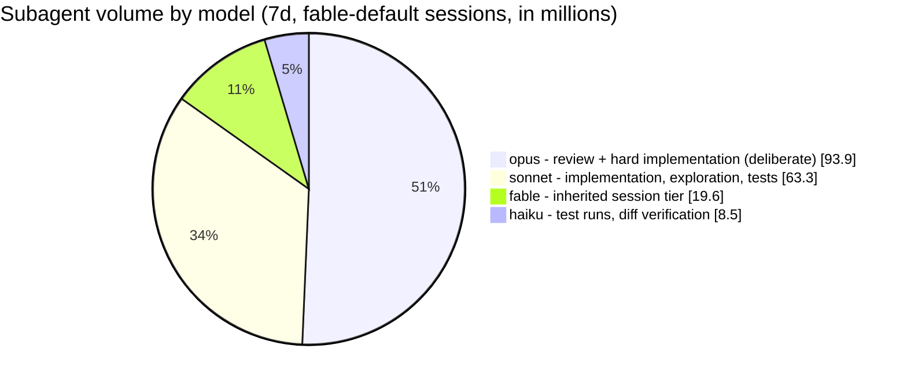
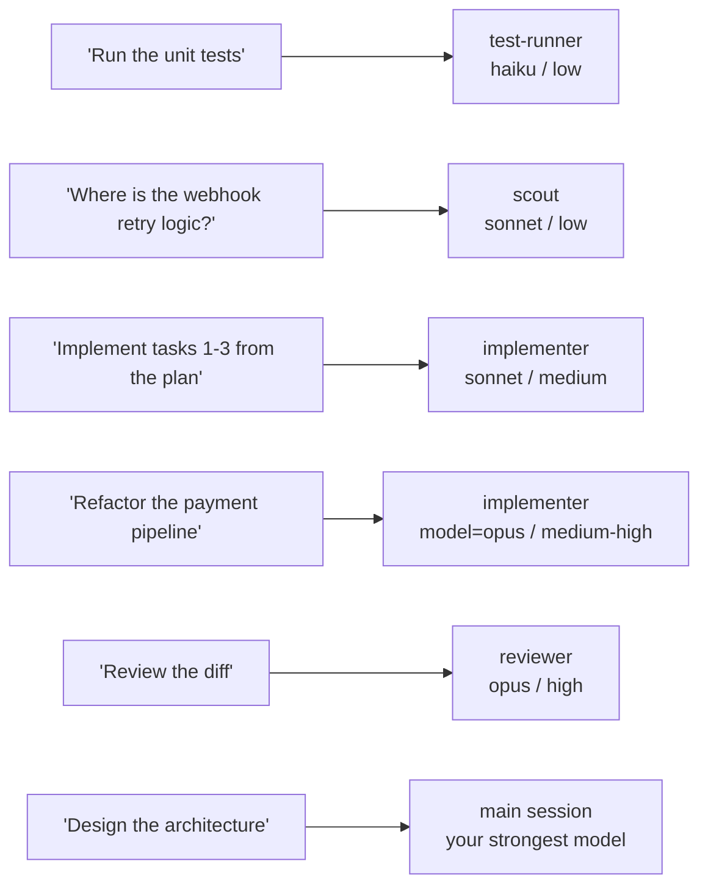

# model-routing

[](https://github.com/AqueGen/model-routing/actions/workflows/validate.yml)

Tiered model routing for Claude Code token economy: **the strongest model
thinks, cheaper models grind.**

Planning and architecture stay in your main session on the best model you
have. Implementation, review, and test runs get delegated to subagents on
cheaper tiers - and the raw output (test logs, file reads) never enters
your main session context, which is where most tokens actually die.

Routing tunes two knobs, not one: **which model** handles a task and **how
hard it thinks** (reasoning effort). A strong model at low effort often
beats a weaker model straining at high effort, for a fraction of the cost -
so cheap, well-scoped work runs at low effort and only genuinely hard
reasoning gets high/max. Each bundled agent pins its effort in frontmatter,
overriding the session setting. When a subagent gets stuck on the approach rather
than a missing fact, it escalates back to the main session for a decision
instead of thrashing.

Everything stays inside Anthropic models. No proxy, no third-party
gateway, no ToS gray zones.

## What's inside

| Component | Model | Effort | Purpose |
| --------- | ----- | ------ | ------- |
| `agents/scout.md` | sonnet | low | Read-only codebase exploration: conclusions and file:line refs come back, file dumps stay out. |
| `agents/test-runner.md` | haiku | low | Run tests/builds/linters, report failures compactly. Never fixes anything. |
| `agents/e2e-runner.md` | sonnet | medium | Drive Playwright/E2E scenarios, interpret failures (product bug vs test bug vs flake). |
| `agents/implementer.md` | sonnet | medium | Implement one well-defined task from an approved plan. Verifies its own work. Dispatch with `model=opus` for multi-file/architectural/subtle work. |
| `agents/reviewer.md` | opus | high | Review a diff for correctness bugs, ranked by severity. |
| `agents/verifier.md` | haiku | low | Cheap gate on a subagent's diff: does it match the task (scope, completeness, obvious breakage)? Not a code review. |
| `skills/model-routing/` | - | - | The routing table and delegation rules Claude follows when deciding where work goes. |
| `hooks/routing-anchor.md` | - | - | Short routing anchor auto-injected at session start - zero config. |
| `hooks/dispatch-counter.mjs` | - | - | Logs every Agent dispatch; `stats`/`report`/`tokens` modes measure what stayed off the session model. |
| `commands/stats.md` | - | - | `/model-routing:stats` - dispatch + token-volume report in the chat. |

## Example

A typical feature session on a strong main model (Opus/Fable):

> Implement tasks 1-2 from the plan, then run the unit tests.

Without the plugin everything happens in the main session: it reads a
dozen files, writes code, and dumps the full test log into your context.
Thousands of expensive tokens spent on mechanics.

With the plugin:

```text
Main session (strong model, plans and coordinates):
  dispatches implementer (sonnet) with two self-contained tasks

    implementer: Changed OrderService.cs (null-payload guard) and
    OrderServiceTests.cs (3 new tests). Build OK, 214/214 unit
    tests pass.

  dispatches test-runner (haiku) for the final check

    test-runner: PASS. 214/214, 0 skipped.
    Command: dotnet test src/Orders.Tests.csproj

  reports back to you.
```

The file reads, diffs, and raw test logs stayed inside the subagents.
Your expensive main-session context grew by two short reports.

## What that looks like in tokens

Real numbers from the author's live workload: sessions running on the
strongest tier (Fable) as the default model, 7-day window, July 2026,
measured by the bundled `tokens --session fable` report - your split
depends on your task mix. Without routing, every subagent inherits the
session model, so the entire volume runs at top-tier prices; with
routing, 100% of dispatches and 89% of token volume dropped below it:



Where that volume actually ran with routing active:



The opus slice is not a leak - on a Fable session even opus is a cheaper
tier, and review plus multi-file implementation are dispatched there
deliberately, because a missed bug costs more than the review. The small
fable slice is the honest remainder: Workflow agents dispatched without
an explicit `model` opt (the exact accidental-inheritance case the
routing rules exist to shrink - 0.7.2 added the rule after this very
measurement). The plugin's job is making every slice a decision instead
of an accident.

Which task lands on which tier:



## Install

```text
claude marketplace add AqueGen/model-routing
```

Then enable the plugin:

```text
/plugin install model-routing@model-routing
```

(or toggle it in the `/plugin` menu, or add
`"model-routing@model-routing": true` to `enabledPlugins` in
`~/.claude/settings.json`).

For local development: clone the repo and
`claude marketplace add /path/to/model-routing`.

## Requirements

- Claude Code with plugin support (agents, skills, hooks).
- `node` 18+ on PATH - used only by the dispatch counter and
  `/model-routing:stats`. The routing itself (skill, agents, session
  anchor) works without node; if node is missing you lose stats, nothing
  else, and the stats command says so instead of printing nothing.
- The tier ladder recognizes the current Claude families
  (fable/opus/sonnet/haiku). A future model family shows up in stats as
  tier-unknown (`?`) rather than silently skewing the numbers.
- Status: validated in daily use (Windows, opus/fable sessions). The
  `tokens` mode parses Claude Code transcript files, whose format may
  evolve - if it breaks, stats degrade to an explanatory message, not
  wrong numbers. Issues welcome.

## Getting started

### Plain use

1. Pick your session model with `/model` (opus, fable, whatever your
   plan offers). The plugin never changes it - the main session is where
   planning and decisions happen, so give it the strongest tier you are
   willing to pay for. Session effort: leave the default (medium); the
   bundled agents pin their own.
2. Work normally. Mechanical work routes down automatically:

   | You ask | Who runs it | Model / effort |
   | ------- | ----------- | -------------- |
   | "Where is X handled?" | `scout` | sonnet / low |
   | "Run the tests" | `test-runner` | haiku / low |
   | "Implement tasks from the plan" | `implementer` | sonnet / medium (`model=opus` for complex work) |
   | "Review the diff" | `reviewer` | opus / high |
   | "Walk through the flow in the browser" | `e2e-runner` | sonnet / medium |

   The main session spends tokens only on planning, decisions, final
   review of high-risk diffs, and reading the agents' short reports.

### Workflow use (brainstorm - plan - execute)

Works with any plan-driven workflow (superpowers or similar):

1. Brainstorming and plan-writing stay in the main session on the
   strongest model - protecting this thinking is the point of the
   plugin.
2. Plan execution goes to `implementer` with a batch of related tasks
   per dispatch (one agent per batch, not per task - every fresh agent
   re-reads files from scratch).
3. Verification: `test-runner` after each batch, `reviewer` on the
   completed chunk, and for high-risk diffs a final review in the main
   session.

### "I don't want the expensive model"

Switch the session down: `/model opus` or `/model opusplan`. Tiers are
relative - "strongest" simply means your session model. Agent pins are
ceilings, not floors: when a pin sits above your session model, the
routing rules cap the dispatch at the session model - on a `sonnet`
session, `implementer` and `reviewer` run on sonnet automatically.
High-risk review still belongs in the main session.

## Usage

The agents show up as regular subagent types. Ask for them explicitly or
let Claude route via the skill:

- "Where is the webhook retry logic?" - Claude dispatches `scout`
  (sonnet); you get the answer with file:line refs, not a pile of file
  contents in your context.
- "Run the unit tests" - Claude dispatches `test-runner` (haiku); you get
  a compact pass/fail report instead of a wall of logs.
- "Implement tasks 1-3 from the plan" - Claude dispatches `implementer`
  (sonnet) with self-contained task descriptions; multi-file or subtle
  work goes out with `model=opus`.
- "Review the diff" - Claude dispatches `reviewer` (opus). For high-risk
  diffs, ask for review in the main session instead - one expensive pass
  is cheaper than a missed bug.
- "Walk through the checkout flow in the browser" - Claude dispatches
  `e2e-runner` (sonnet).

The routing rules live in the `model-routing` skill and activate when
Claude decides where to send work. Two rules worth knowing:

- **Batch tasks per subagent.** Each subagent re-reads files from scratch;
  ten one-line tasks as ten agents costs more than one agent with ten
  tasks.
- **Repo policies win.** If your project says "never run integration
  tests", the runner respects it.

## Why each choice

Every model and effort assignment follows from where a tier actually earns
its cost. The knobs are two: **model** (raw capability) and **effort**
(how hard it thinks) - a strong model at low effort routinely beats a weak
model at high effort for a fraction of the price, so both are tuned per
task, not set together.

| Situation | Model | Effort | Why this model | Why this effort |
| --------- | ----- | ------ | -------------- | --------------- |
| Exploration (`scout`) | sonnet | low | Finding and tracing code is retrieval, not reasoning - a cheap tier reports as well as a costly one, and the file volume stays in the subagent regardless. | The work is mechanical lookup; extra thinking buys nothing. |
| Ordinary implementation (`implementer`) | sonnet | medium | SWE-bench Verified puts the top tier only ~1-2 points over sonnet (as of mid-2026: 80.8% vs 79.6%) at several times the cost - for single-file, clear-shape work that margin never changes the outcome. | The plan already decided the approach; the agent executes real logic, not design. |
| Complex implementation (`implementer` `model=opus`) | opus | medium-high | Multi-file refactors, concurrency, and security are exactly where the 1-2 point gap turns into a wrong-approach-is-expensive gap; the stronger reasoning pays for itself. | Higher because the approach itself is part of the problem, not just the code. |
| Code review (`reviewer`) | opus | high | Review is an asymmetric bet - one pass guards against a bug that costs far more if it ships, so it is the one place to prefer the top tier by default. | High: subtle correctness bugs hide from shallow reading. |
| Tests / builds (`test-runner`) | haiku | low | Running a command and summarizing output is mechanical; the value is keeping raw logs out of the main context, not the model doing it. | Low: no reasoning, just report. |
| Diff sanity gate (`verifier`) | haiku | low | Checking a diff matches its task (scope, completeness, obvious breakage) is a cheap spot-check, not a quality judgment. | Low: pattern-matching against the task, not deep analysis. |
| E2E / failure interpretation (`e2e-runner`) | sonnet | medium | Driving a browser and telling a product bug from a flake needs some judgment, but not top-tier reasoning. | Medium: real interpretation, clear method. |
| Planning, architecture, high-risk final review | main session (strongest) | high | These set the direction everything else follows - the one place raw capability changes the outcome most. | High: a wrong call here is the most expensive kind to unwind. |

Research backing: task-type routing beats complexity-score routing
([RouteLLM, ICLR 2025](https://arxiv.org/pdf/2406.18665)); the sonnet-vs-top-tier
[SWE-bench Verified](https://www.swebench.com) margin is what makes sonnet
the implementation default with opus reserved for the margin cases; the
20% rework threshold the dispatch report warns on comes from coding-agent
routing practice
([Augment](https://www.augmentcode.com/guides/ai-model-routing-guide)) -
if a routed-down tier needs rework more than ~1 time in 5, the price edge
is gone and that task type should route up. Benchmark numbers are a
snapshot (mid-2026) and shift with every release; the principle - a small
tier gap on ordinary work, a decisive one on hard work - has held across
generations.

The overall shape - one strong orchestrator delegating scoped tasks to
cheaper workers and consuming their compact reports - is the
orchestrator-workers pattern from Anthropic's
[Building Effective Agents](https://www.anthropic.com/engineering/building-effective-agents),
implemented on Claude Code's native
[subagents](https://code.claude.com/docs/en/sub-agents) (frontmatter
`model`/`effort` pins, per-dispatch `model` override) rather than any
external machinery.

## Recommended settings

**Session model + effort (the weighted price/quality pick).** The session
model is not where the grind happens - the plugin routes exploration,
implementation, and tests down to cheaper tiers - so the session model
only needs to be strong enough for the high-value seat: planning,
coordination, and final review. That makes the balanced default:

- **Session model: Opus.** Near-frontier reasoning for the decisions that
  cascade through everything downstream, without paying the very top tier
  on every turn. The plugin already keeps the cheap work off it. Reserve
  the strongest tier (Fable/Mythos-class) for sessions that are *entirely*
  hard reasoning - a thorny architecture day or a subtle debugging hunt -
  where the whole session sits in the seat that tier is worth. Drop to a
  **Sonnet** session for pure-implementation days with no hard decisions.
- **Effort: medium** as the everyday default; **high** for sessions built
  around architecture or subtle debugging. Session effort mainly governs
  main-session work - the bundled agents pin their own - so raise it when
  the thinking you keep in the main seat is genuinely hard, not across the
  board.

Rule of thumb: pick the session tier for the *hardest thing you keep in
the main session*, not for the average task - the average task gets routed
down anyway.

Fallback down the tier ladder when your primary model hits its quota
(`~/.claude/settings.json`):

```json
{
  "fallbackModel": ["opus", "sonnet"]
}
```

For sessions that do not need the strongest tier, the built-in hybrid is a
good lazy default:

```text
/model opusplan
```

(Opus plans, Sonnet executes - no plugin needed.)

## Dispatch counter

Every Agent dispatch is logged by a PostToolUse hook (agent name + model,
nothing else) to `<config>/model-routing/dispatches.jsonl`, self-pruned to
30 days. Stats show how much work routing actually kept off your session
model - real counts, not invented dollar savings:

```text
/model-routing:stats
# in-chat report: per-agent dispatch breakdown + real token volume per model
# also flags "tier leaks" - unpinned dispatches that inherited a strong
# session model bare; warns past the 20% rework threshold

/model-routing:stats --days 1
# today's slice; --days N sizes the window (default 7)

/model-routing:stats --days 7 --ago 7
# the week before last week's end - before/after comparison when you
# tune routing (dispatch history reaches 30 days back; token history as
# far as Claude Code keeps transcripts)

/model-routing:stats --session fable
# only sessions that ran on your default model - useful when a
# fallbackModel ladder or manual /model switches mix tiers into one
# window and you want the numbers for your normal setup
```

```text
node "<plugin>/hooks/dispatch-counter.mjs" stats
# routed-down: 14 today · 92 7d  (one-liner for status lines)

node "<plugin>/hooks/dispatch-counter.mjs" tokens
# token volume per model from subagent transcripts (7d), with the share
# that ran BELOW its own session's model - fable days and opus days are
# each judged against their own baseline
```

Coverage note: dispatch counts see Agent-tool dispatches only (the hook
matches `Agent|Task`); Workflow-spawned agents never pass through that
tool, so they are invisible to the dispatch report - but `tokens` reads
their transcripts (nested under `subagents/workflows/`) and counts their
volume against the parent session like any other subagent.

Embed the one-liner in your status line by appending the command's output
to whatever your `statusLine.command` already prints. Delete the `.jsonl`
any time to reset; a missing file just means zero.

Smoke tests for the counter: `node --test hooks/dispatch-counter.test.mjs`.

## Zero config

The plugin injects a short routing anchor at session start (SessionStart
hook), so the rules are always in context - no CLAUDE.md edits needed.
The anchor text lives in `hooks/routing-anchor.md`; the full logic is in
the `model-routing` skill. If you had pasted a routing snippet into your
`CLAUDE.md` before, remove it - the hook replaces it.

## Overriding pins

There is deliberately no config subsystem - three override paths cover it:

- **Per dispatch**: the Agent tool's `model` param overrides any
  frontmatter pin (pins-are-ceilings works through exactly this);
  Workflow `agent()` takes `model` and `effort` opts per call. Plain
  Agent dispatches have no effort param - they inherit the session
  effort.
- **Permanent**: edit the `model:` / `effort:` frontmatter in
  `agents/*.md`. A directory-source install picks the change up next
  session. Keep `PINNED_MODELS` in `hooks/dispatch-counter.mjs` in step -
  the CI sync test fails the build when the two drift, because that drift
  silently corrupts the stats (it happened once; see 0.7.1).
- **Reset**: `git checkout -- agents` in the plugin checkout, or
  reinstall from the marketplace.

A runtime config file was considered and rejected: the harness reads
model pins from agent frontmatter directly, so a config file could only
be advisory prose asking Claude to pass overrides - more surface, weaker
guarantee. The agent files are the config.

## Why not a router proxy?

[claude-code-router](https://github.com/musistudio/claude-code-router) and
similar gateways solve a different problem: routing across providers
(OpenAI, Gemini, DeepSeek...). If you live inside Anthropic models, a
proxy adds a failure point and ToS risk for no gain. Subagent delegation
is native, supported, and does the same tier-splitting.

## License

MIT
