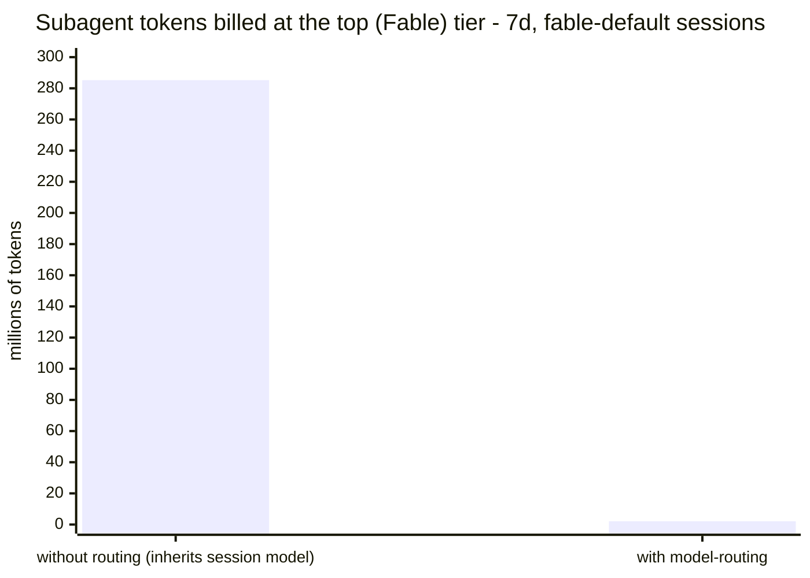
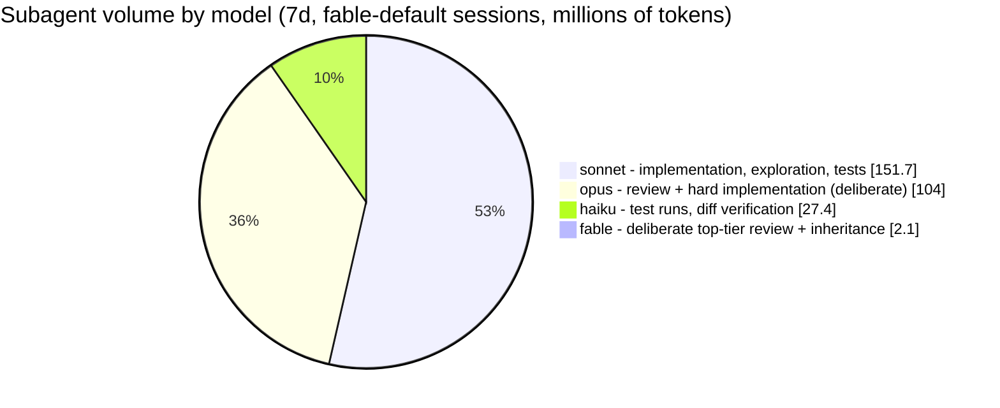
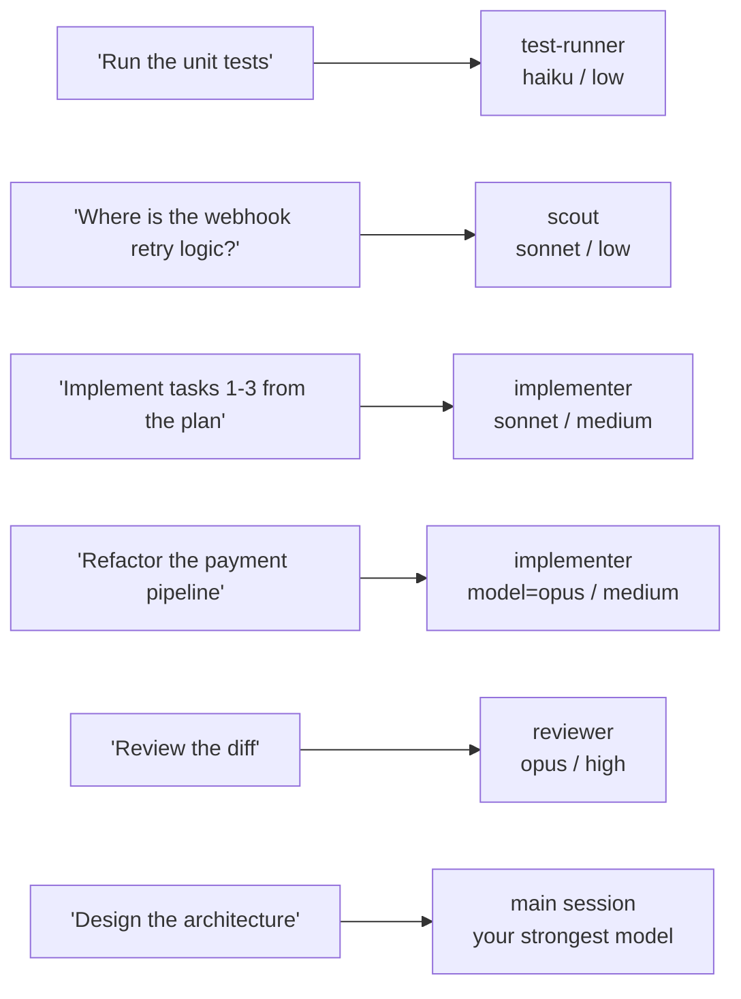

# model-routing

[](https://github.com/AqueGen/model-routing/actions/workflows/validate.yml)

Tiered model routing for Claude Code token economy: **the strongest model
thinks, cheaper models grind.**

Planning and architecture stay in your main session on the best model you
have. Implementation, review, and test runs get delegated to subagents on
cheaper tiers - and the raw output (test logs, file reads) never enters
your main session context, which is where most tokens actually die.

Routing tunes two knobs, not one: **which model** handles a task and **how
hard it thinks** (reasoning effort). A strong model at low effort often
beats a weaker model straining at high effort, for a fraction of the cost -
so cheap, well-scoped work runs at low effort and only genuinely hard
reasoning gets high or above. Each bundled agent pins its effort in frontmatter,
overriding the session setting. When a subagent gets stuck on the approach rather
than a missing fact, it escalates back to the main session for a decision
instead of thrashing.

Everything stays inside Anthropic models. No proxy, no third-party
gateway, no ToS gray zones.

**Quick links:** [Overview](#whats-inside) | [Example](#example) |
[Install](#install) | [Getting started](#getting-started) |
[Usage](#usage) | [Tiers](#model-tiers-and-effort-ladder) |
[Settings](#recommended-settings) | [Workflows](#dynamic-workflows) |
[Stats](#dispatch-counter) | [Pin overrides](#overriding-pins)

## What's inside

| Component | Model | Effort | Purpose |
| --------- | ----- | ------ | ------- |
| `agents/scout.md` | sonnet | low | Read-only codebase exploration: conclusions and file:line refs come back, file dumps stay out. |
| `agents/test-runner.md` | haiku | low | Run tests/builds/linters, report failures compactly. Never fixes anything. |
| `agents/e2e-runner.md` | sonnet | medium | Drive Playwright/E2E scenarios, interpret failures (product bug vs test bug vs flake). |
| `agents/implementer.md` | sonnet | medium | Implement one well-defined task from an approved plan. Verifies its own work. Dispatch with `model=opus` for multi-file/architectural/subtle work. |
| `agents/reviewer.md` | opus | high | Review a diff for correctness bugs, ranked by severity. |
| `agents/verifier.md` | haiku | low | Cheap gate on a subagent's diff: does it match the task (scope, completeness, obvious breakage)? Not a code review. |
| `skills/model-routing/` | - | - | The routing table and delegation rules Claude follows when deciding where work goes. |
| `hooks/routing-anchor.md` | - | - | Short routing anchor auto-injected at session start - zero config. |
| `hooks/dispatch-counter.mjs` | - | - | Logs every Agent dispatch; `stats`/`report`/`tokens` modes measure what stayed off the session model. |
| `commands/stats.md` | - | - | `/model-routing:stats` - dispatch + token-volume report in the chat. |

## Example

A typical feature session on a strong main model (Opus/Fable):

> Implement tasks 1-2 from the plan, then run the unit tests.

Without the plugin everything happens in the main session: it reads a
dozen files, writes code, and dumps the full test log into your context.
Thousands of expensive tokens spent on mechanics.

With the plugin:

```text
Main session (strong model, plans and coordinates):
  dispatches implementer (sonnet) with two self-contained tasks

    implementer: Changed OrderService.cs (null-payload guard) and
    OrderServiceTests.cs (3 new tests). Build OK, 214/214 unit
    tests pass.

  dispatches test-runner (haiku) for the final check

    test-runner: PASS. 214/214, 0 skipped.
    Command: dotnet test src/Orders.Tests.csproj

  reports back to you.
```

The file reads, diffs, and raw test logs stayed inside the subagents.
Your expensive main-session context grew by two short reports.

## What that looks like in tokens

**Snapshot: 2026-08-02, measured with v0.13.0** - the author's live workload over the preceding 7 days, via `dispatch-counter.mjs tokens`, `... tokens --session fable` and `... report --session fable`. A fixed snapshot, not a live figure: the rolling window moves daily and your split depends on your task mix - re-measure your own with the same commands.

**Read the scope before the numbers,** because there are two of them and they are easy to mix up.

| | All sessions | Fable-default sessions (the charts below) |
| --- | --- | --- |
| Main-session volume, not routable | 6.85B | 1.08B across 33 sessions |
| Subagent volume, routable | 1.77B | 285.2M across 103 agents |
| Subagents as a share of the total | 21% of 8.64B | 21% of 1.36B |
| Ran below the session tier | 33% | 99% |

Two things follow. First, the main session is not in any chart here and never can be: its model is fixed for the turn, so no routing decision moves it. Routing governs about a fifth of what was actually spent, and the charts describe how well it governs that fifth - not how much of the bill it removes. Second, the 99% belongs to the fable-scoped column: on an opus-default session an opus subagent is not a step down, so there is little room to route anywhere, which is most of the gap between 99% and 33%. Both figures are true, and `tokens` now prints them together so the flattering one is never read alone.

The charts below take the fable-scoped column. In it, 98% of dispatches (82 of 84) and 283.1M of 285.2M tokens ran below the session tier. Without routing every subagent inherits the session model, so the whole 285.2M would bill at Fable prices; with routing 2.1M did:


```mermaid
xychart-beta
    title "Subagent tokens billed at the top (Fable) tier - 7d, fable-default sessions"
    x-axis ["without routing (inherits session model)", "with model-routing"]
    y-axis "millions of tokens" 0 --> 300
    bar [285.2, 2.1]
```

**That left bar is an upper bound, not a measurement.** It assumes every subagent would otherwise inherit the session model, which is the documented default for an UNPINNED agent - but pinned agents exist independently of this plugin. Other installed plugins ship their own pinned agents, and Claude Code's built-in `Explore` picks its own tier. Some of this volume would have run cheaply with model-routing uninstalled; how much was not measured, so read the bar as the ceiling of what routing can be credited with rather than the amount it saved.

Attribution over the same week, across all 266 dispatches, 199 of which ran below their session tier:

| Mechanism | Dispatches | What it means |
| --- | ---: | --- |
| Agent frontmatter pins shipped by this plugin | 68 | Automatic. The agent file names the tier, so it fires whether or not any routing rule is followed |
| An explicit `model=` on the dispatch | 127 | Behavioural. This is the routing rules being applied, and nothing enforces them |
| Claude Code's built-in `Explore` | 4 | Not this plugin at all |

The honest reading: the automatic half is fully attributable, the behavioural half depends on the session actually following the anchor, and there is no control group - this is the author's own workload measured with the author's own tool, with no before-install baseline. `CLAUDE_CODE_SUBAGENT_MODEL` was not set in this window, which the report would otherwise have annotated per row.

Where that volume actually ran with routing active:


```mermaid
pie showData title Subagent volume by model (7d, fable-default sessions, millions of tokens)
    "sonnet - implementation, exploration, tests" : 151.7
    "opus - review + hard implementation (deliberate)" : 104.0
    "haiku - test runs, diff verification" : 27.4
    "fable - deliberate top-tier review + inheritance" : 2.1
```

The opus slice is not a leak - on a Fable session even opus is a cheaper tier, and review plus multi-file implementation are dispatched there deliberately, because a missed bug costs more than the review.

The fable slice is worth reading against the previous snapshot (2026-07-20, v0.8.1), where it was 21.4M of 166.8M - mostly Workflow `agent()` calls dispatched with no explicit `model` opt. 0.7.2 added the Workflow routing rule in response to that exact measurement, and the accidental part of this slice is now a rounding error. Most of what remains is the opposite of a leak: a `model=fable` reviewer dispatched ON PURPOSE at the top tier, above the session, to review this release. The counter reports it as above-tier work rather than hiding it, which is the behaviour 0.8.0 added. Tier leaks sit at 1 of 11 unpinned dispatches (9%), under the 20% rework threshold the report warns at. The plugin's job is making every slice a decision instead of an accident, and a visible, attributable top-tier slice is what a decision looks like.

Which task lands on which tier:


```mermaid
flowchart LR
    A["'Run the unit tests'"] --> TR["test-runner<br/>haiku / low"]
    B["'Where is the webhook retry logic?'"] --> SC["scout<br/>sonnet / low"]
    C["'Implement tasks 1-3 from the plan'"] --> IM["implementer<br/>sonnet / medium"]
    D["'Refactor the payment pipeline'"] --> IMO["implementer<br/>model=opus / medium"]
    E["'Review the diff'"] --> RV["reviewer<br/>opus / high"]
    F["'Design the architecture'"] --> MS["main session<br/>your strongest model"]
```

## Install

```text
claude marketplace add AqueGen/model-routing
```

Then enable the plugin:

```text
/plugin install model-routing@model-routing
```

(or toggle it in the `/plugin` menu, or add
`"model-routing@model-routing": true` to `enabledPlugins` in
`~/.claude/settings.json`).

For local development: clone the repo and
`claude marketplace add /path/to/model-routing`.

## Requirements

- Claude Code with plugin support (agents, skills, hooks).
- `node` 18+ on PATH - used only by the dispatch counter and
  `/model-routing:stats`. The routing itself (skill, agents, session
  anchor) works without node; if node is missing you lose stats, nothing
  else, and the stats command says so instead of printing nothing.
- The tier ladder recognizes the current Claude families
  (fable/opus/sonnet/haiku). A future model family shows up in stats as
  not tier-comparable rather than silently skewing the numbers.
- Status: validated in daily use (Windows, opus/fable sessions). The
  `tokens` mode parses Claude Code transcript files, whose format may
  evolve - if it breaks, stats degrade to an explanatory message, not
  wrong numbers. Issues welcome.
- Continuing a stuck agent uses `SendMessage` when the harness provides
  it; where it is absent the skill falls back to re-dispatching with the
  packaged state. Neither path is a hard requirement.
- What "read-only" means here: scout, reviewer, verifier and test-runner
  block the file-edit tools (`Edit`, `Write`, `NotebookEdit`) at the tool
  level via `disallowedTools`. `Bash` (needed to run tests and inspect
  repos) and MCP tools remain available and could in principle mutate
  state - that boundary is behavioral (prompt rules), not a sandbox.
  Scout deliberately uses a denylist rather than a tool allowlist so a
  connected code-graph MCP server stays usable (an allowlist silently
  hides every MCP tool).

## Getting started

### Plain use

1. Pick your session model with `/model` (opus, fable, whatever your
   plan offers). The plugin never changes it - the main session is where
   planning and decisions happen, so give it the strongest tier you are
   willing to pay for. Session effort: Claude's own default is high
   (unset = high); dropping the session to medium is the cost-conscious
   pick when the main session mostly coordinates - the bundled agents pin
   their own either way.
2. Work normally. Mechanical work routes down automatically:

   | You ask | Who runs it | Model / effort |
   | ------- | ----------- | -------------- |
   | "Where is X handled?" | `scout` | sonnet / low |
   | "Run the tests" | `test-runner` | haiku / low |
   | "Implement tasks from the plan" | `implementer` | sonnet / medium (`model=opus` for complex work) |
   | "Review the diff" | `reviewer` | opus / high |
   | "Walk through the flow in the browser" | `e2e-runner` | sonnet / medium |

   The main session spends tokens only on planning, decisions, final
   review of high-risk diffs, and reading the agents' short reports.

### Superpowers flow (brainstorm - plan - execute)

Works with any plan-driven process (superpowers or similar):

1. Brainstorming and plan-writing stay in the main session on the
   strongest model - protecting this thinking is the point of the
   plugin.
2. Plan execution goes to `implementer` with a batch of related tasks
   per dispatch (one agent per batch, not per task - every fresh agent
   re-reads files from scratch).
3. Verification: `test-runner` after each batch, `reviewer` on the
   completed chunk, and for high-risk diffs a final review in the main
   session.

### "I don't want the expensive model"

Switch the session down: `/model opus` or `/model opusplan`. Tiers are
relative - "strongest" simply means your session model. Agent pins are
ceilings, not floors: when a pin sits above your session model, the
routing rules instruct Claude to cap the dispatch at the session model
(Agent `model` param) - on a `sonnet` session, `implementer` and
`reviewer` run on sonnet. Honesty note: the cap is a routing rule, not a
harness guarantee - a bare dispatch runs the frontmatter pin as-is. The
dispatch report has a dedicated "Ran ABOVE the session tier" section, so
a missed cap shows up as a number instead of hiding.
High-risk review still belongs in the main session.

## Usage

The agents show up as regular subagent types. Ask for them explicitly or
let Claude route via the skill:

- "Where is the webhook retry logic?" - Claude dispatches `scout`
  (sonnet); you get the answer with file:line refs, not a pile of file
  contents in your context.
- "Run the unit tests" - Claude dispatches `test-runner` (haiku); you get
  a compact pass/fail report instead of a wall of logs.
- "Implement tasks 1-3 from the plan" - Claude dispatches `implementer`
  (sonnet) with self-contained task descriptions; multi-file or subtle
  work goes out with `model=opus`.
- "Review the diff" - Claude dispatches `reviewer` (opus). For high-risk
  diffs, ask for review in the main session instead - one expensive pass
  is cheaper than a missed bug.
- "Walk through the checkout flow in the browser" - Claude dispatches
  `e2e-runner` (sonnet).

The routing rules live in the `model-routing` skill and activate when
Claude decides where to send work. Two rules worth knowing:

- **Batch tasks per subagent.** Each subagent re-reads files from scratch;
  ten one-line tasks as ten agents costs more than one agent with ten
  tasks.
- **Repo policies win.** If your project says "never run integration
  tests", the runner respects it.

## Why each choice

Every model and effort assignment follows from where a tier actually
earns its cost (the knobs themselves:
[Model tiers and effort ladder](#model-tiers-and-effort-ladder)):

| Situation | Model | Effort | Why this model | Why this effort |
| --------- | ----- | ------ | -------------- | --------------- |
| Exploration (`scout`) | sonnet | low | Finding and tracing code is retrieval, not reasoning - a cheap tier reports as well as a costly one, and the file volume stays in the subagent regardless. | The work is mechanical lookup; extra thinking buys nothing. |
| Ordinary implementation (`implementer`) | sonnet | medium | Sonnet is near-opus quality on single-file, clear-shape coding at a fraction of the price (intro pricing through 2026-08-31 makes it ~2.5x cheaper than opus) - for work whose approach the plan already decided, the margin never changes the outcome. | The plan already decided the approach; the agent executes real logic, not design. |
| Complex implementation (`implementer` `model=opus`) | opus | medium (pinned) | Multi-file or cross-layer changes, security/money/migrations/concurrency/public contracts, or a retry after a weak sonnet result - a wrong approach is expensive, and Opus 5 stepped the tier up at UNCHANGED price, so escalate when in doubt. (Ambiguous tasks are not an escalation case: implementer stops on ambiguity by contract - clarify first.) | The `model=opus` dispatch changes the model only - the Agent tool has no effort param, so the pinned medium stays; the escalation buys the tier, not extra thinking. |
| Code review (`reviewer`) | opus | high | Review is an asymmetric bet - one pass guards against a bug that costs far more if it ships, so it is the one place to prefer the top tier by default. | High: subtle correctness bugs hide from shallow reading. Anthropic reports Opus 5 review holds at lower effort - medium is a future eval candidate; the pin stays high until measured. |
| Tests / builds (`test-runner`) | haiku | low | Running a command and summarizing output is mechanical; the value is keeping raw logs out of the main context, not the model doing it. | Low: no reasoning, just report. |
| Diff sanity gate (`verifier`) | haiku | low | Checking a diff matches its task (scope, completeness, obvious breakage) is a cheap spot-check, not a quality judgment. | Low: pattern-matching against the task, not deep analysis. |
| E2E / failure interpretation (`e2e-runner`) | sonnet | medium | Driving a browser and telling a product bug from a flake needs some judgment, but not top-tier reasoning. | Medium: real interpretation, clear method. |
| Planning, architecture, high-risk final review | main session (strongest) | high | These set the direction everything else follows - the one place raw capability changes the outcome most. | High: a wrong call here is the most expensive kind to unwind. |

The 0.10.0 report caps follow the same accounting. [Anthropic's own
context-engineering
guidance](https://www.anthropic.com/engineering/effective-context-engineering-for-ai-agents)
describes the shape a subagent should have: it may spend tens of
thousands of tokens exploring and return a distilled summary of
roughly 1,000-2,000 tokens. The caps (test-runner PASS <= 5
lines, scout <= 15, e2e step log <= 20) are that principle applied to a
success path - failures are never truncated, because a failure IS the
high-signal content.

Research backing: task-type routing beats complexity-score routing
([RouteLLM, ICLR 2025](https://arxiv.org/pdf/2406.18665)); the
sonnet-vs-opus tier gap on benchmarks such as
[SWE-bench Verified](https://www.swebench.com) is what makes sonnet
the implementation default with opus reserved for the margin cases; the
20% rework threshold the dispatch report warns on comes from coding-agent
routing practice
([Augment](https://www.augmentcode.com/guides/ai-model-routing-guide)) -
if a routed-down tier needs rework more than ~1 time in 5, the price edge
is gone and that task type should route up. Benchmark numbers are a
snapshot (last reviewed July 2026, at the
[Opus 5 launch](https://www.anthropic.com/news/claude-opus-5)) and shift
with every release; the principle - a small tier gap on ordinary work, a
decisive one on hard work - has held across generations, with one
refinement per generation: when a new top-of-family ships at unchanged
price (Opus 5 did), the escalation bar drops, not the default tier.

The overall shape - one strong orchestrator delegating scoped tasks to
cheaper workers and consuming their compact reports - is the
orchestrator-workers pattern from Anthropic's
[Building Effective Agents](https://www.anthropic.com/engineering/building-effective-agents),
implemented on Claude Code's native
[subagents](https://code.claude.com/docs/en/sub-agents) (frontmatter
`model`/`effort` pins, per-dispatch `model` override) rather than any
external machinery.

## Model tiers and effort ladder

What each family is for in this routing scheme. Names are family
aliases, not versions (see
[Recommended settings](#recommended-settings) on generation jumps), and
cost is anchored relative to opus - ratios drift less than list prices;
exact numbers live on
[Anthropic's pricing page](https://platform.claude.com/docs/en/about-claude/pricing):

| Family | Cost vs opus | Role in this plugin |
| ------ | ------------ | ------------------- |
| fable | ~2x | Frontier reasoning. A main-session choice for all-hard-reasoning days (architecture, subtle debugging hunts) - never a routing target. |
| opus | 1x | The escalation tier: code review, multi-file/cross-layer implementation, security/money/concurrency-sensitive changes. Opus 5 made this tier a step stronger at the same price. |
| sonnet | ~0.6x (~0.4x intro through 2026-08-31) | The workhorse: ordinary implementation from an approved plan, exploration, E2E driving. Near-opus on clear-shape coding. |
| haiku | ~0.2x | Mechanical grind: test/build runs, diff sanity checks, trivial sweeps. |

Generation notes (as of the Opus 5 launch, July 2026 - these rot
fastest, re-verify against Anthropic's model overview): per Anthropic's
launch figures Opus 5 lands near the fable-class tier on coding at half
its price, which is what lowered the escalation bar in 0.9.0; Sonnet 5 at medium is
comparable to Sonnet 4.6 at high (per Anthropic's effort guidance),
which is why the medium pins survived the generation jump unchanged;
the fable-class tier is built for long-horizon frontier work - a
session-model choice, not a dispatch target.

The effort ladder - the second knob. Unset effort means `high` on every
model that supports effort, the one exception being Opus 4.7, which
defaults to `xhigh`. Support itself is an explicit list rather than a
version cutoff: Fable 5, Opus 5, Sonnet 5, Opus 4.8 and Opus 4.7 take the
whole ladder, Opus 4.6 and Sonnet 4.6 take everything but `xhigh`, and a
model absent from that list - Haiku 4.5 among them - has no effort knob at
all. Setting a level a model does not support runs the highest supported
level at or below it, so `xhigh` becomes `high` on Opus 4.6. The vendor
recommendation is
per-generation ([effort
reference](https://platform.claude.com/docs/en/build-with-claude/effort)):
Opus 4.7 and 4.8 start coding and agentic work at `xhigh`, while Opus 5
starts at `high`, steps up to `xhigh` for demanding coding and agentic
work, and treats `low` and `medium` as the primary cost control. The
pins below are this plugin's cost-first reading of that: start low,
step up on evidence.

| Effort | What it buys | Where the plugin uses it |
| ------ | ------------ | ------------------------ |
| low | Most efficient: significant token savings with some capability reduction. On the Opus 5 generation low/medium punch well above their weight. | Pins: `scout`, `test-runner`, `verifier`. |
| medium | Balanced: real logic whose approach is already decided, at moderate savings. | Pins: `implementer`, `e2e-runner`. Recommended session setting. |
| high | Full capability - the product default. Complex reasoning, subtle debugging, high-risk review. | Pin: `reviewer`. Main-session planning and final review. |
| xhigh | Extended capability for long-horizon agentic/coding runs (multi-hour, token budgets in the millions). | Session-level or Workflow `effort` opt only - never an agent pin. |
| max | Unconstrained token spend for frontier-grade problems; Anthropic notes diminishing returns and overthinking risk on routine work. | Not used by any pin - reach for it deliberately or not at all. |

## Recommended settings

**Session model + effort (the weighted price/quality pick).** The session
model is not where the grind happens - the plugin routes exploration,
implementation, and tests down to cheaper tiers - so the session model
only needs to be strong enough for the high-value seat: planning,
coordination, and final review. That makes the balanced default:

- **Session model: Opus.** Near-frontier reasoning for the decisions that
  cascade through everything downstream, without paying the very top tier
  on every turn. The plugin already keeps the cheap work off it. Reserve
  the strongest tier (Fable/Mythos-class) for sessions that are *entirely*
  hard reasoning - a thorny architecture day or a subtle debugging hunt -
  where the whole session sits in the seat that tier is worth. Drop to a
  **Sonnet** session for pure-implementation days with no hard decisions.
- **Effort: medium** as the everyday session setting - a deliberate step
  DOWN from Claude's product default of high. Use **high** for sessions
  built around architecture or subtle debugging. Session effort mainly
  governs main-session work - the bundled agents pin their own - so raise
  it when the thinking you keep in the main seat is genuinely hard, not
  across the board.

Rule of thumb: pick the session tier for the *hardest thing you keep in
the main session*, not for the average task - the average task gets routed
down anyway.

Generation jumps are free: agent pins name model FAMILIES (opus, sonnet,
haiku), so when a new family member ships (Opus 4.8 -> Opus 5 at the same
price), reviewer and every `model=opus` escalation upgrade automatically -
no plugin update, no config change. `/model-routing:stats` shows which
models actually ran. One behavioral note for Opus 5 sessions: the model
delegates to subagents more readily than its predecessors, which makes
the conscious-tier rule (explicit `model=` on unpinned dispatches) more
load-bearing, not less - watch the tier-leak line in the report.

Fallback down the tier ladder when your primary model hits its quota
(`~/.claude/settings.json`):

```json
{
  "fallbackModel": ["opus", "sonnet"]
}
```

For sessions that do not need the strongest tier, the built-in hybrid is a
good lazy default:

```text
/model opusplan
```

(Opus plans, Sonnet executes - no plugin needed.)

For a stronger model at decision points without running it throughout, the harness has a built-in advisor tool - `/advisor opus`, or `"advisorModel": "opus"` in settings. It runs server-side, sees the whole conversation, and Claude decides when to consult it, which makes it the productized form of the advisor pattern this plugin describes. Two traps worth knowing: the advisor must be at least as capable as the main model (an Opus 4.7-or-later session accepts only another Opus 4.7+, not Sonnet 5), and Fable is not currently offered as an advisor - a saved `"fable"` attaches no advisor and raises no error. Advisor calls never show up in `/model-routing:stats`, because a server tool is not an Agent dispatch; they land in `/usage`.

### Dynamic workflows

A workflow run spawns subagents per stage, so its cost scales with
fan-out rather than with your session. Two settings decide most of it
([dynamic workflows](https://code.claude.com/docs/en/workflows)):

- **Dynamic workflow size** in `/config` defaults to `medium` (under 15
  agents) on Claude Code 2.1.219 and later; older versions defaulted to
  `unrestricted`. The values are `small` under 5, `medium` under 15,
  `large` under 50. It steers the fan-out before a run starts and needs
  no plugin - but it is advice, not a cap: a prompt that calls for a
  different scale still overrides it, and the runtime caps (16
  concurrent, 1000 per run) are the only hard limits. Choosing a value
  yourself also moves the `Large workflow` warning to that agent count
  (the other trigger, a projected 1.5M tokens, stays), which cuts both
  ways: `small` warns earlier, `large` warns later, at 50. The warning
  tracks the choice, not the value: leave the setting untouched and it
  stays at 25, even though the default value is `medium`.
- **Ultracode** (`/effort ultracode`) is the deliberate opposite:
  `xhigh` effort plus automatic workflow planning for every substantial
  task, and it suppresses the large-run warning because switching it on
  already consents to large runs. This plugin does not fight it. What
  changes is where the savings come from: with fan-out consented to,
  set `model`/`effort` per `agent()` call so each node is cheap, instead
  of trying to keep the fan-out small.

Inside a script, every `agent()` call without `model`/`effort` opts
inherits the session model at session effort - see the skill's Workflows
chapter for the full set of rules.

## Dispatch counter

Every Agent dispatch is logged by a PostToolUse hook (agent name, model, the
session model, and the session effort level - nothing else) to
`<config>/model-routing/dispatches.jsonl`, self-pruned to 30 days. Stats show
how much work routing actually kept off your session model - real counts, not
invented dollar savings:

```text
/model-routing:stats
# in-chat report: per-agent dispatch breakdown + real token volume per model
# also flags "tier leaks" - unpinned dispatches that inherited a strong
# session model bare; warns past the 20% rework threshold

/model-routing:stats --days 1
# today's slice; --days N sizes the window (default 7)

/model-routing:stats --days 7 --ago 7
# the week before last week's end - before/after comparison when you
# tune routing (dispatch history reaches 30 days back; token history as
# far as Claude Code keeps transcripts)

/model-routing:stats --session fable
# only sessions that ran on your default model - useful when a
# fallbackModel ladder or manual /model switches mix tiers into one
# window and you want the numbers for your normal setup
```

```text
node "<plugin>/hooks/dispatch-counter.mjs" stats
# routed-down: 14 today · 92 7d  (one-liner for status lines)

node "<plugin>/hooks/dispatch-counter.mjs" tokens
# token volume per model from subagent transcripts (7d), with the share
# that ran BELOW its own session's model - fable days and opus days are
# each judged against their own baseline
```

Coverage note: dispatch counts see Agent-tool dispatches only (the hook
matches `Agent|Task`); Workflow-spawned agents never pass through that
tool, so they are invisible to the dispatch report - but `tokens` reads
their transcripts (nested under `subagents/workflows/`) and counts their
volume against the parent session like any other subagent.

### The effort line

`report` also prints how many dispatches ran on an agent type carrying no effort pin, and therefore inherited whatever the session was set to. That is the failure a tier-only report scores as a win: a mechanical errand sent to `general-purpose` with `model=sonnet` still thinks as hard as your session does, while `scout` would have run the same errand at `low`.

Effort is reconstructed rather than observed, because transcripts do not record it. The sources are read in the order Claude Code applies them: `CLAUDE_CODE_EFFORT_LEVEL` first (the only place `max` is accepted), then `effortLevel` from the settings cascade (local, then project, then user - these accept `low`/`medium`/`high`/`xhigh` only), then the documented model default described in [the effort ladder](#model-tiers-and-effort-ladder). Levels that came from that last rung are counted separately in the report, so an inferred default never reads as a setting somebody chose, and a level the session model does not support is recorded as the one Claude Code falls back to instead. Two cases contribute nothing to the line rather than a guess: a session on a model the docs give no effort support, and a session whose model could not be read at all, since the same configured level means different things on different models.

The line states its limits rather than hiding them, and there are more than the sources suggest. Four documented states override the reconstruction and none of them are visible to a hook: a `/effort` or `--effort` choice made inside a running session, ultracode (which sends `xhigh`), an organization effort cap, and the model-default hold that Fable 5, Opus 4.8 and Opus 4.7 apply on first run over a level you previously set. Only the pins of the bundled agents are known here too - an agent from another plugin may pin its own effort and will still be counted as inheriting. Read the figure as what the visible sources resolve to, not as a measurement.

Embed the one-liner in your status line by appending the command's output
to whatever your `statusLine.command` already prints. Delete the `.jsonl`
any time to reset; a missing file just means zero.

Smoke tests for the counter: `node --test hooks/dispatch-counter.test.mjs`.

## Zero config

The plugin injects a short routing anchor at session start (SessionStart
hook), so the rules are always in context - no CLAUDE.md edits needed.
The anchor text lives in `hooks/routing-anchor.md`; the full logic is in
the `model-routing` skill. If you had pasted a routing snippet into your
`CLAUDE.md` before, remove it - the hook replaces it.

## Overriding pins

There is deliberately no config subsystem - four override paths cover it:

- **Whole session**: the `CLAUDE_CODE_SUBAGENT_MODEL` env var outranks
  everything below it - both an explicit `model` param and a frontmatter
  pin - and the dispatch report marks those rows `agent (env=...)`.
- **Per dispatch**: the Agent tool's `model` param overrides any
  frontmatter pin (pins-are-ceilings works through exactly this);
  Workflow `agent()` takes `model` and `effort` opts per call. Plain
  Agent dispatches have no effort param - effort comes from the agent's
  frontmatter pin when present, else from the session level.
- **Permanent**: edit the `model:` / `effort:` frontmatter in
  `agents/*.md`. A directory-source install picks the change up next
  session. Keep `AGENT_PINS` in `hooks/dispatch-counter.mjs` in step - it
  carries both the model and the effort column, and a CI sync test fails the
  build when either drifts from the frontmatter, because that drift silently
  corrupts the stats (it happened once; see 0.7.1).
- **Reset**: `git checkout -- agents` in the plugin checkout, or
  reinstall from the marketplace.

A runtime config file was considered and rejected: the harness reads
model pins from agent frontmatter directly, so a config file could only
be advisory prose asking Claude to pass overrides - more surface, weaker
guarantee. The agent files are the config.

## Staying up to date

Marketplace installs never auto-update: Claude Code refreshes marketplace catalogs in the background, but your installed copy stays at its version until you run `claude plugin update model-routing` (or `/plugin update` in the terminal UI). Because that is easy to forget, the plugin checks for a newer version at most once a day on session start and prints a one-line notice when you are behind. The check is a single fetch of the published manifest, fails silently offline, and never installs anything - updating stays your call.

## Releasing (maintainer notes)

Releases are cut by [release-please](https://github.com/googleapis/release-please): conventional commits land on `main`, the bot keeps a release PR open that accumulates them, and merging that PR tags the release, publishes the GitHub release notes, and bumps `.claude-plugin/plugin.json`. Ground rules:

- `docs:` and `chore:` commits do not trigger a release - README and changelog-only work ships without a version bump, because a version bump asks every user to run a manual update.
- Merge the release PR when the accumulated changes are worth that manual update (a feature or a fix a user would notice), not on every commit.
- Before merging, open the release PR's `CHANGELOG.md` diff and add a one-sentence summary line under the new version header - release bodies that start with a bare bullet list read as truncated.

## Why not a router proxy?

[claude-code-router](https://github.com/musistudio/claude-code-router) and
similar gateways solve a different problem: routing across providers
(OpenAI, Gemini, DeepSeek...). If you live inside Anthropic models, a
proxy adds a failure point and ToS risk for no gain. Subagent delegation
is native, supported, and does the same tier-splitting.

## License

MIT
